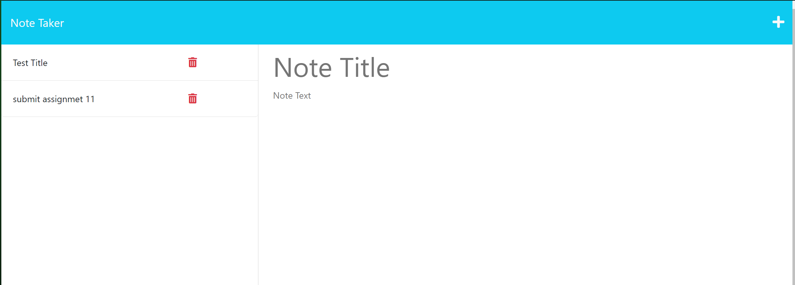

# Express Note App

## Description

A Website to keep track of notes

## Table of Contents

- [Deployment](#deployment)
- [Usage](#usage)
- [License](#license)
- [Contributing](#contributing)
- [Questions](#questions)

## Deployment

https://ch-express-notes-df4ac28531ba.herokuapp.com/notes

## Usage

On the right you can sumbit new notes and you can delete saved notes on the left once you are finished with them

## License

This project is licensed under the [MIT License]([License Details](https://opensource.org/licenses/MIT)).

## Contributing

Cardon Hickman

## Questions

https://github.com/C-Hickman3
cardonhickman@gmail.com
